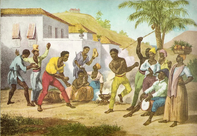

# Adega do Ventura

[Voltar](README.md)

## Outros tópicos

### Capoeira na EACH

-   Eu cheguei a fazer capoeira regional baiana quando adolescente (ah, o pique, a agilidade e a flexibilidade daquela época!...), mas, no mestrado, eu treinei Angola durante um semestre com o impressionante [Mestre Jogo de Dentro](https://www.sementedojogodeangola.org.br/pt/mestre.html) e me apaixonei por Angola (com todo o devido respeito que a regional merece); pena que depois mudaram o local de Barão Geraldo para o centro de Campinas e aí não pude mais acompanhar 🙁
-   Daí imagina minha felicidade quando descobri que teríamos um grupo de vivência de capoeira Angola no meu trabalho, conduzido por Dini ([Valdinei Freire](https://www.each.usp.br/valdinei/)), professor lá na EACH e aluno de Mestre Plínio no [Angoleiros Sim Sinhô](https://www.instagram.com/angoleiro.sim.sinho.sp/)
-   As vivência de Capoeira Angola na EACH neste semestre (1o/2024) estão ocorrendo nas terças e sextas-feiras das 12:15 às 13:30 no Ginásio; é um espaço de acolhimento e segurança para todes, todas e todos poderem descobrir seus tempos e suas expressões em seus corpos, com proteção e respeito à diversidade
-   Venha! Você canta, você dança, você joga, você toca instrumento, você se exercita, você descobre que não tem mais os mesmos pique, agilidade e flexibilidade de antigamente 😆, você corre pra dar tempo de pegar o bandex, é mó legal! 😃
