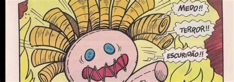

# Adega do Ventura

[Voltar](README.md)

## Ensino

### Disciplinas

> " Medo!!\
> Terror!!\
> Escuridão!!"
>
> -- Boneca Tenebrosa

#### Graduação

Atuais:

-   [ACH4573 Probabilidade]() -- bacharelado em Marketing, EACHUSP
-   [ACH4513 Inferência Estatística]() -- bacharelado em Marketing, EACHUSP
-   [ACH4514 Análise Multivariada 1]() -- bacharelado em Marketing, EACHUSP
-   [ACH4515 Análise Multivariada 2]() -- bacharelado em Marketing, EACHUSP

Antigas:

-   [ACH4532 Cálculo 1]() -- bacharelado em Marketing,  EACHUSP, 2013, 2011
-   [ACH0021 Tratamento e Análise de Dados/Informações]() -- ciclo básico, EACHUSP, 2013
-   [ACH4553 Cálculo II]() -- bacharelado em Marketing,  EACHUSP, 2011
-   [ACH4618 Experimentos em Marketing]() -- bacharelado em Marketing,  EACHUSP, 2010, 2008
-   [ACH0041 Resolução de Problemas 1]() -- ciclo básico, EACHUSP, 2009, 2008, 2007
-   [ACH0042 Resolução de Problemas 2]() -- ciclo básico, EACHUSP, 2007
-   [ME480 Estatística para Biologistas]() -- bacharelado em Biologia, Unicamp, 2006

#### Pós-graduação

Antigas:

-   [PMA5642 Avaliação Educacional]() -- PROFMAT, EACHUSP, 2017, 2015
-   [MA12 Matemática Discreta]() -- PROFMAT, EACHUSP, 2016
-   [PMA5641 Probabilidade e Estatística]() -- PROFMAT, EACHUSP, 2014
