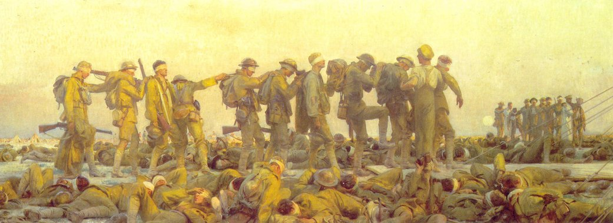

# Adega do Ventura

[Voltar](README.md)

## Ensino

### Orientações (IC, TCC, Mestrado)

#### Em andamento

-   GIMME -- Grupo de Iniciação Científica do Marcelo de Métodos ~~Estranhos~~ Estatísticos
    -   Giovana Alencar
    -   Giovanna Alcassa
    -   João Tosoli
    -   Matheus Bruzaca
    -   Victor Campos

#### Anteriores

##### Dissertação de Mestrado

-   Joseliza Maria Machado dos Santos Amadeu, 2016 (não concluída)
-   [Edson Ferreira Costa, PROFMAT, 2014](https://sca.profmat-sbm.org.br/profmat_tcc.php?id1=4119&id2=95573)

##### Trabalhos de Conclusão de Curso

-   Luís Fábio dos Santos Castilho, 2014
-   Isabela Cristina da Silva Januário, 2013

##### Iniciação Científica

-   Filipe Ferminiano Rodrigues, 2011
-   Salvador Iglesias Ramalho, 2011
-   Paulo Vitor Barthelemi Mescollote, 2010

##### Monitoria

-   Luís Fábio dos Santos Castilho, 2015
-   Walney Barbosa dos Reis, 2014
-   Ingrid Mariane Dutra de Araujo, 2014 e 2013
-   Thiago Garcia Ochiro, 2013
