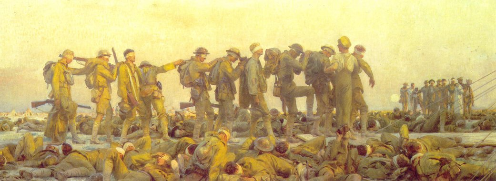

# Adega do Ventura

[Voltar](README.md)

## Ensino

### Orientações (IC, TCC, Mestrado)

> Disse-lhes ainda uma parábola: "Pode acaso um cego guiar outro cego?"
>
> Lucas 6:39

#### Em andamento

<!---
-   GIMME -- Grupo de Iniciação Científica do Marcelo de Métodos ~~Estranhos~~ Estatísticos
 --->
-   Nope. Nada aqui por enquanto

#### Anteriores

##### Dissertação de Mestrado

-   Joseliza Maria Machado dos Santos Amadeu, 2016 (não concluída)
-   [Edson Ferreira Costa, PROFMAT, 2014](https://sca.profmat-sbm.org.br/profmat_tcc.php?id1=4119&id2=95573)

##### Trabalhos de Conclusão de Curso

-   Luís Fábio dos Santos Castilho, 2014
-   Isabela Cristina da Silva Januário, 2013

##### Iniciação Científica

-   Giovana Alencar, 2024  (não concluída)
-   Giovanna Alcassa, 2024  (não concluída)
-   João Tosoli, 2024  (não concluída)
-   Matheus Bruzaca, 2024  (não concluída)
-   Victor Campos, 2024  (não concluída)
-   Filipe Ferminiano Rodrigues, 2011
-   Salvador Iglesias Ramalho, 2011
-   Paulo Vitor Barthelemi Mescollote, 2010

##### Monitoria

-   Luís Fábio dos Santos Castilho, 2015
-   Walney Barbosa dos Reis, 2014
-   Ingrid Mariane Dutra de Araujo, 2014 e 2013
-   Thiago Garcia Ochiro, 2013
